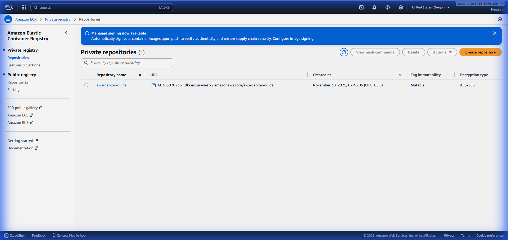
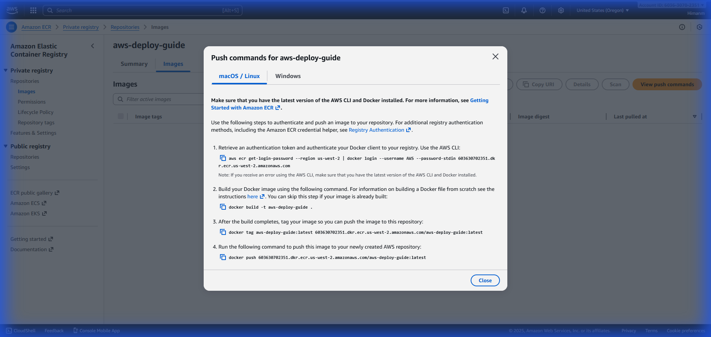
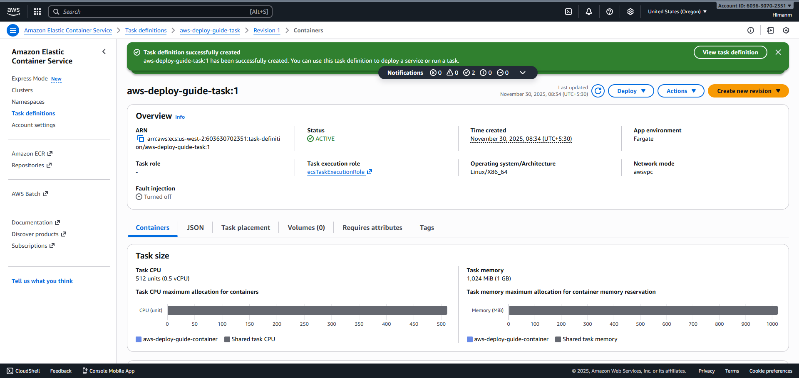
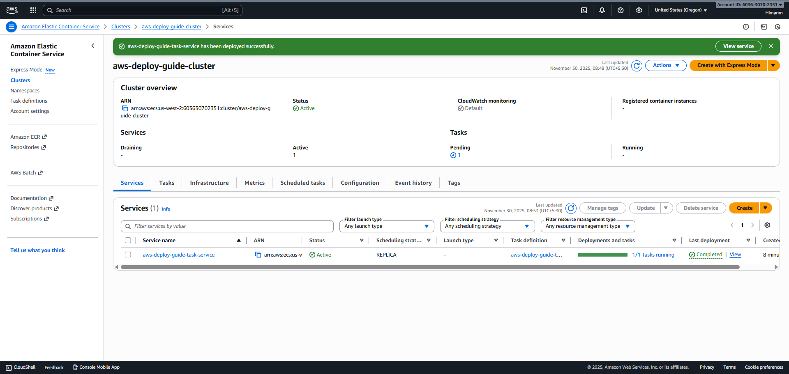
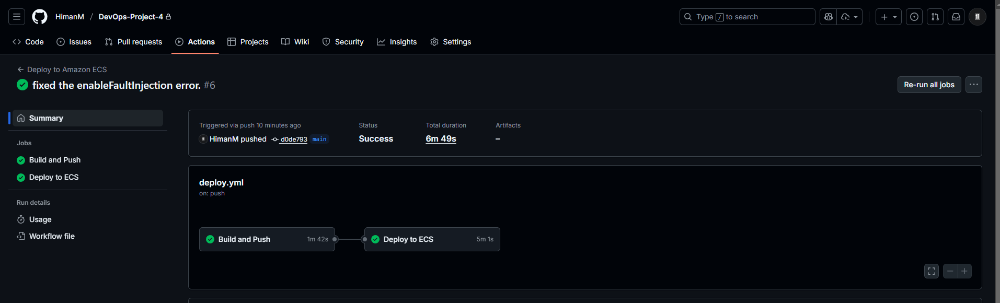

# AWS Deployment Guide and DevOps Project Hub

This repository contains a Next.js application designed to serve as a comprehensive, interactive guide for deploying containerized applications to AWS ECS Fargate. It documents the entire DevOps lifecycle, from configuring AWS credentials to setting up a CI/CD pipeline with GitHub Actions.

The application itself is a hands-on learning tool, featuring a step-by-step workflow visualization, detailed command explanations, and a centralized dashboard for other DevOps projects.

## Project Overview

The primary goal of this project is to demystify the process of deploying a Dockerized application to the cloud. It breaks down complex AWS tasks into manageable steps, providing visual aids and direct links to necessary resources.

### Key Features

*   **Interactive Deployment Workflow**: A guided experience through the AWS deployment process.
*   **Mobile-Optimized Design**: A responsive interface that works seamlessly on desktop and mobile devices.
*   **Automated CI/CD**: A fully functional GitHub Actions pipeline for continuous deployment.
*   **DevOps Dashboard**: A collection of links to related DevOps initiatives.

## Technical Architecture

*   **Frontend Framework**: Next.js 14 (React)
*   **Styling**: Tailwind CSS
*   **UI Components**: Shadcn/UI, Lucide Icons
*   **Infrastructure**: AWS ECS (Fargate), AWS ECR, AWS IAM
*   **Containerization**: Docker
*   **CI/CD**: GitHub Actions

## Deployment Walkthrough

This section documents every step required to deploy the application, corresponding to the interactive guide within the app.

### 1. AWS Configuration

The first step involves setting up the necessary permissions and tools to interact with AWS.

**Create Access Keys**
Generate programmatic access keys in the AWS IAM Console to allow the AWS CLI to authenticate.

### 2. Container Registry (ECR)

Amazon Elastic Container Registry (ECR) is used to store the Docker images.

**Create Repository**
A new repository is created to host the application image.

**Push Commands**
The AWS CLI provides specific commands to authenticate Docker and push the image.

**Successful Push**
Verifying that the image has been successfully uploaded to ECR.

**Repository Content**
The ECR repository now contains the tagged Docker image.

### 3. ECS Cluster Setup

Amazon Elastic Container Service (ECS) is the orchestration service used to run the containers.

**Cluster Creation Form**
Configuring a new Fargate cluster in the AWS Console.

**Cluster Created**
The ECS Cluster is successfully provisioned and ready to host services.

### 4. Task Definition

The Task Definition serves as a blueprint for the application, specifying the container image, CPU, and memory requirements.

**Configure Task Definition (Step 1)**
Setting the task family name and infrastructure requirements.

**Configure Container (Step 2)**
Specifying the container details and port mappings.

**Select Image URI**
Using the URI of the image pushed to ECR earlier.

**Task Definition Created**
The task definition is successfully registered.

### 5. Service Deployment

The ECS Service maintains the desired number of tasks and handles networking.

**Create Service (Step 1)**
Defining the service name and desired task count.

**Environment Configuration (Step 2)**
Setting up the deployment type and platform version.

**Deployment Settings (Step 3)**
Configuring deployment strategies (e.g., rolling updates).

**Networking (Step 4)**
Defining the VPC, subnets, and security groups for the service.

**Service Created**
The service is successfully created and begins provisioning tasks.

### 6. Verification

Once the service is stable, the application is accessible via the public IP of the Fargate task.

**Access Application**
The application is live and accessible in the browser.

**Deployed Dashboard**
The live dashboard showing the successful deployment.

## CI/CD Pipeline

The project includes a GitHub Actions workflow to automate the build and deploy process.

**GitHub Secrets**
Securely storing AWS credentials and configuration variables in GitHub.

**Workflow Visualization**
The GitHub Actions interface showing the progress of the build and deploy jobs.

 
### Required Secrets

To enable the CI/CD pipeline, the following secrets must be configured in the GitHub Repository:

*   AWS_ACCESS_KEY_ID
*   AWS_SECRET_ACCESS_KEY
*   AWS_REGION
*   ECR_REPOSITORY
*   ECS_CLUSTER
*   ECS_SERVICE
*   ECS_TASK_DEFINITION
*   CONTAINER_NAME

## Educational Project Disclaimer

This is an educational project designed to demonstrate DevOps best practices and modern web development techniques. Anyone is free to fork this repository and modify anything to suit their own learning needs or project requirements.
